<!-- Vertical Ontology -->
[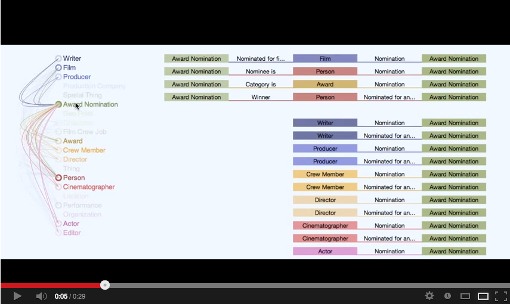](http://www.youtube.com/watch?v=4W8prhPX9ZI)
Movie Ontology with Labels

<!-- Box Plot -->
[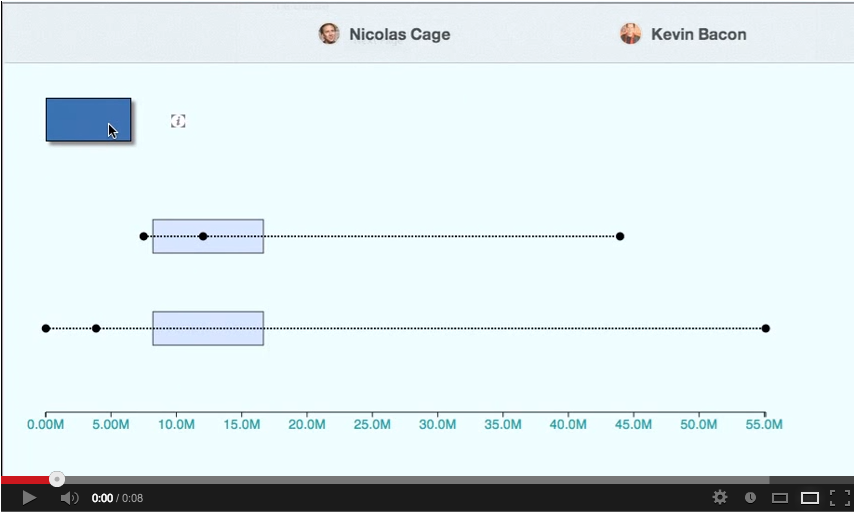](http://youtu.be/i3ciZqJSLMI)
Animated Box Plot

<!-- Colorful Ontology -->
[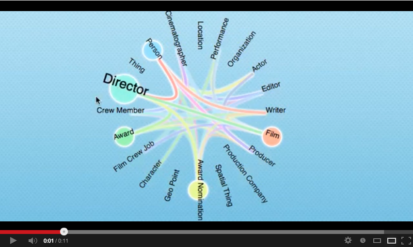](http://youtu.be/M3TkpepPLNk)
Graph of a Movie Ontology

<!-- Force Directed Sample -->
[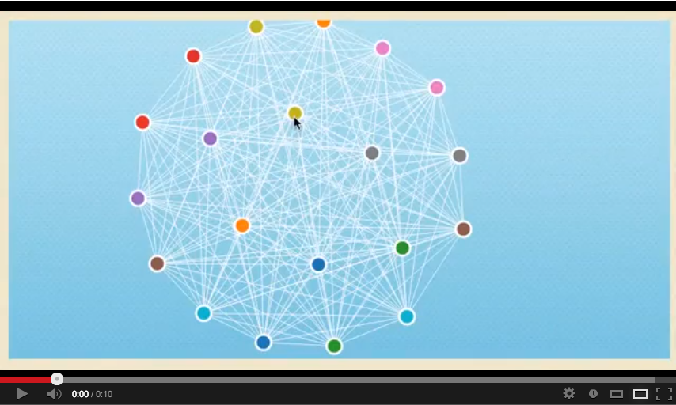](http://youtu.be/3Z22BCVnXjM)
Force Directed Fun-Ball

<!-- Graph Connections -->
[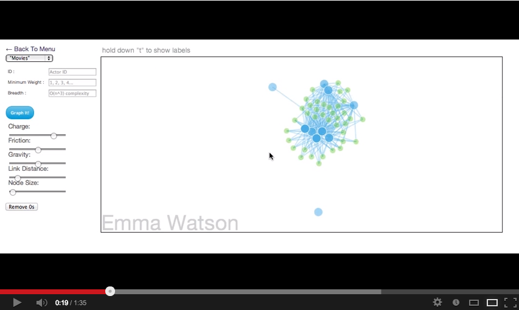](http://youtu.be/YEdGC-Diicw)
Graphing Utility to see degrees of connections between actors 

<!-- Ontology Overview -->
[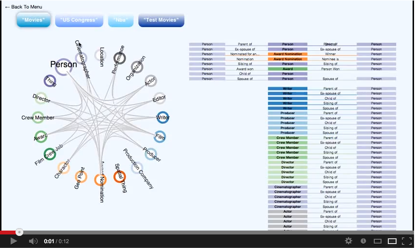](http://youtu.be/FqiKLn8kGTU)
Movie Ontology with Labels, Circular Layout

<!-- Sigma Graph -->
[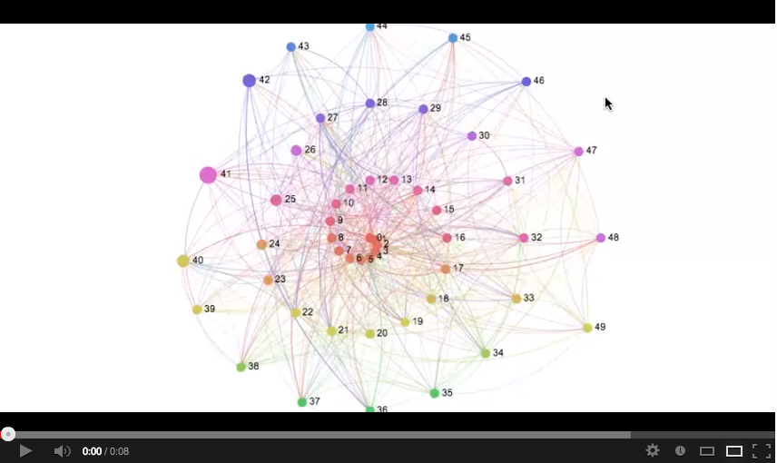](http://youtu.be/8Gw_M5DwrAA)
Example of Sigma.js Graph with fisheye effect mouseover
<!-- Time Series -->
[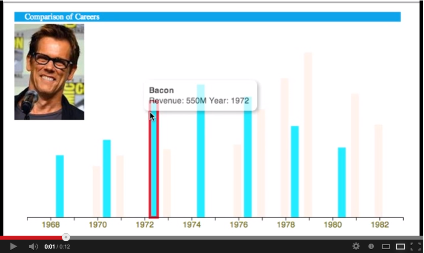](http://youtu.be/YUBmOYbqp3w)
Time Series Bar Graph Example
<!-- spark relief -->;
[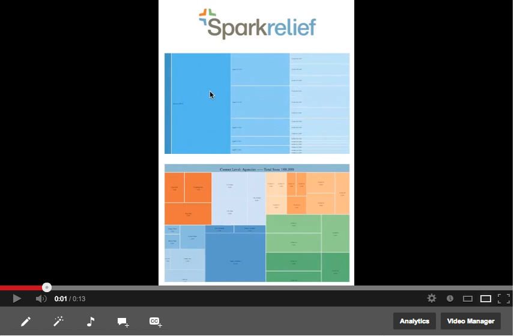](http://www.youtube.com/watch?v=trDaNm6-7Rk&feature=youtu.be)

Sample from Graphing Utility

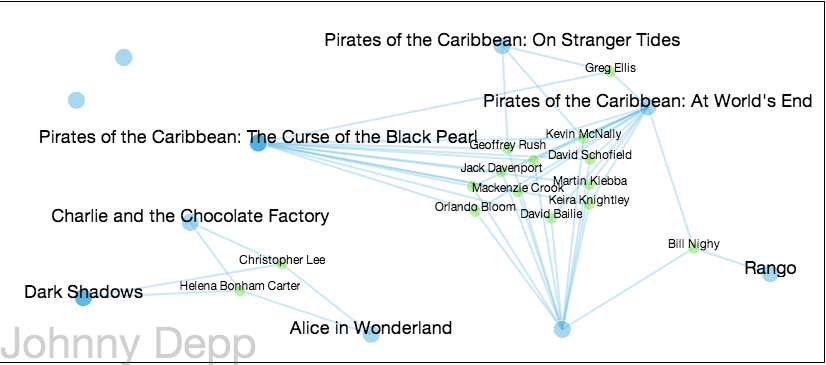
Sample from Graphing Utility

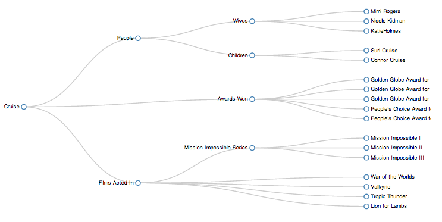
Hierarchy Graph Example
