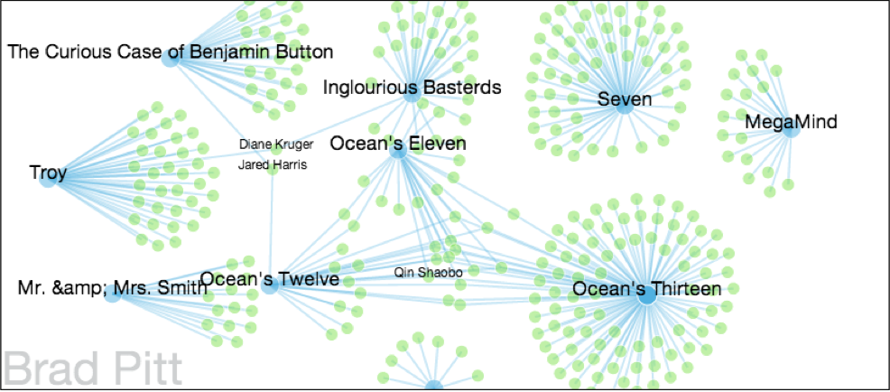

<!-- Box Plot -->

Animated Box Plot

<!-- Colorful Ontology -->

Graph of a Movie Ontology

<!-- Force Directed Sample -->

Force Directed Fun-Ball

<!-- Graph Connections -->

Graphing Utility to see degrees of connections between actors 

<!-- Ontology Overview -->

Movie Ontology with Labels

<!-- Sigma Graph -->

Example of Sigma.js Graph with fisheye effect mouseover
<!-- Time Series -->

Time Series Bar Graph Example

Sample from Graphing Utility

Sample from Graphing Utility

Hierarchy Graph Example
